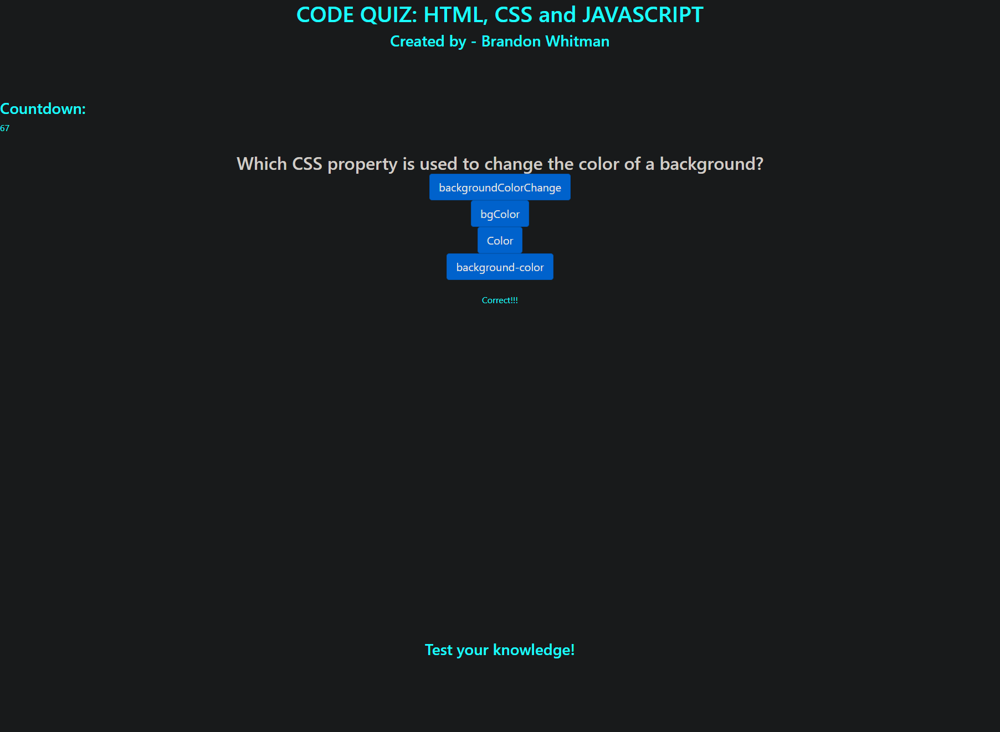

# Code Quiz
  
  ## Description
  This is a browser based Code Quiz app, built using Web-API's, that asks the user questions related to HTML, CSS, and Javascript and logs user scores. 
   
  
  ## Table of Contents
  - [Usage](#usage)
  - [Contributing](#contributing)
  - [Languages Used](#languages)
  - [Questions](#questions)
   

  ## Screenshot and Link to Deployed Site 
    
     
    <a href="https://bwhitman33.github.io/Code-Quiz/"> Git Pages Deployed Link </a>
     
  ## Usage
  Simply access the website and answer some questions!
   

  ## Contributing
  Brandon Whitman
   
  Jason G with the late game assist on getting logged scores to display on the leaderboard. Thanks dude!
   

  ## Languages Used
  HTML, CSS, and Javascript
   

  ## Questions
  Any questions can be asked at Bwhitman33@gmail.com. 
    
  The github repository for this project can be found at [Bwhitman33](https://github.com/Bwhitman33/Code-Quiz)

